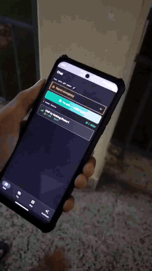
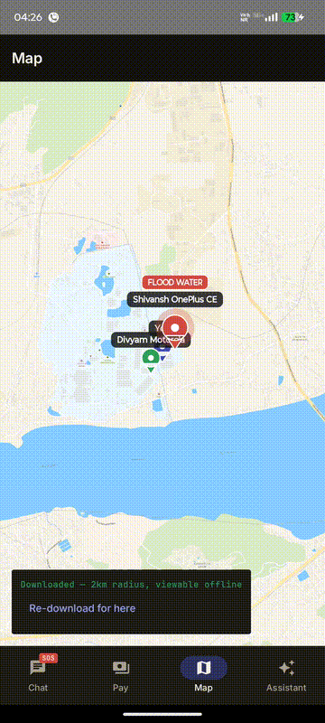
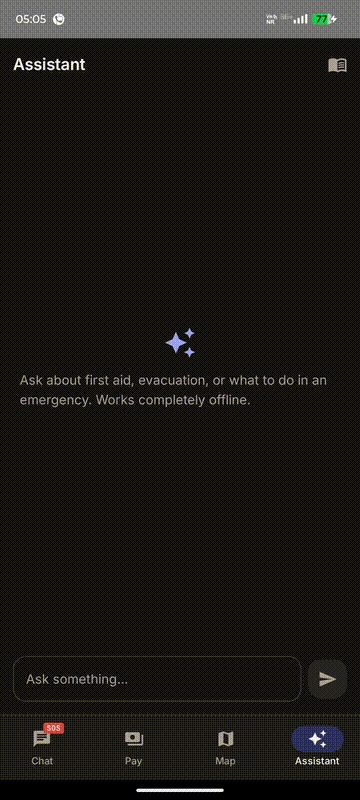
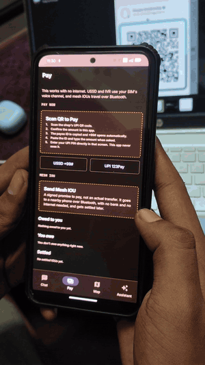
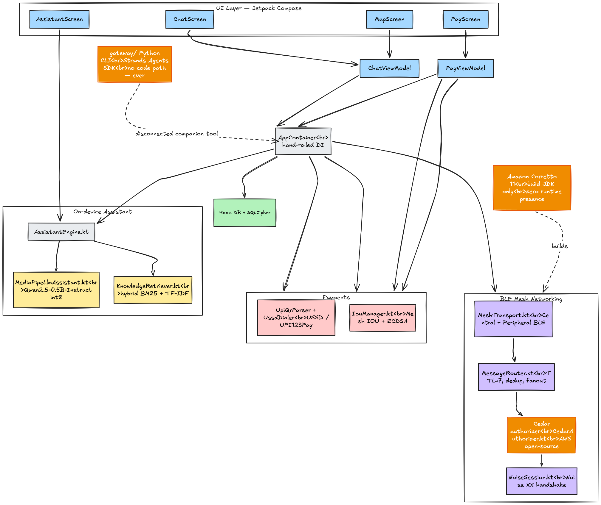
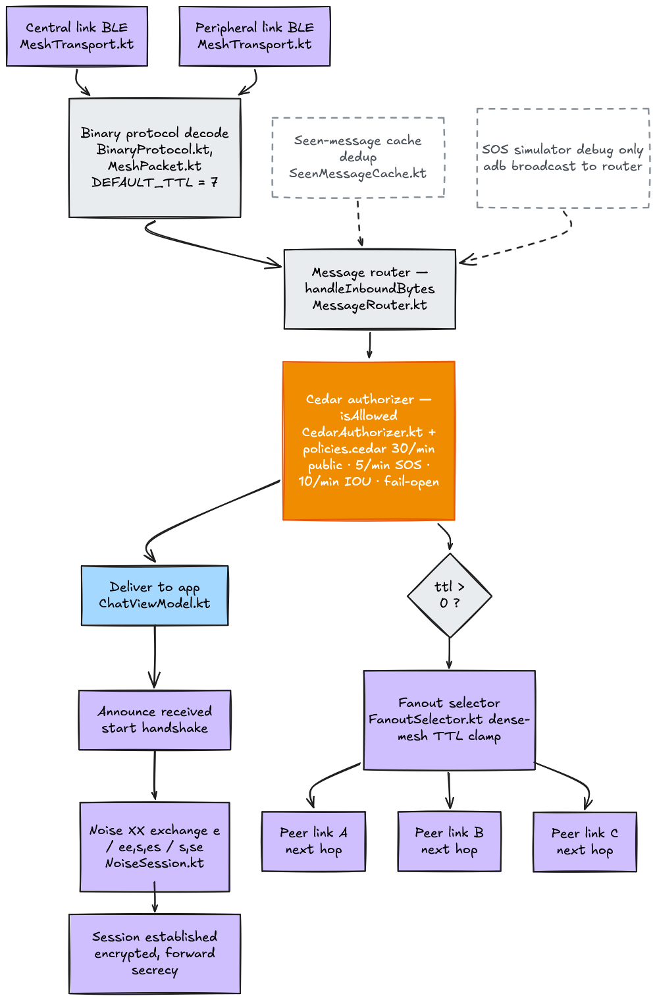
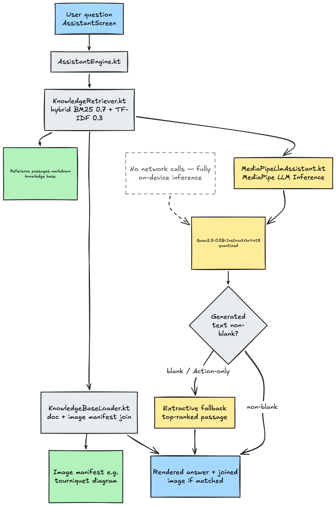
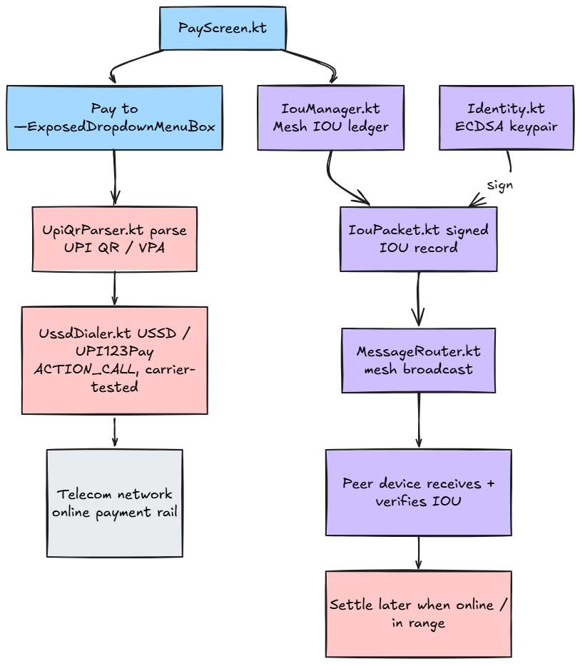

# Sankat Setu

An Android app for the hours or days after a disaster knocks out cell towers and internet in an area , flood, earthquake, cyclone, whatever it is. Phones keep talking to each other directly over Bluetooth, relaying messages hop by hop so people can coordinate, ask for help, and even pay each other without a single tower or server in the loop.

Built for **First Commit** (Bharat Builds Tour), Build It track.

## Introduction

Most emergency-response software assumes you have internet. The moment that assumption breaks , which is exactly when a flood or earthquake takes out local infrastructure , those apps stop working, right when people need them most.

Sankat Setu doesn't make that assumption. Two phones with Bluetooth on can talk to each other with airplane mode fully enabled, no SIM, no Wi-Fi, no shared network of any kind. If a third phone is nearby, it relays messages for phones that aren't in direct range of each other. The mesh is the only infrastructure the app depends on, and every phone running the app is part of it.

On top of that mesh, the app gives people three things they actually need during a crisis: a way to send and receive messages (including a one-tap SOS broadcast), a way to pay for things even without a data connection, and an on-device assistant that can answer first-aid and survival questions using a real medical reference library, without ever needing to reach a server.

## What we built

### Mesh chat and SOS

A phone connects to nearby phones over Bluetooth LE, and every message , a normal chat message, an SOS, an "I'm safe" broadcast, a payment IOU , travels through a binary wire protocol with a TTL, so it can hop through several phones before reaching its destination. Direct messages between two phones that have connected to each other go through a full Noise `XX` handshake first, so they're end-to-end encrypted with forward secrecy; SOS and "I'm safe" broadcasts go out unencrypted on purpose, because they need to reach every phone in range, not just phones you've already paired with.



SOS reports and connected peers show up as pins on an offline map (downloaded once, in advance, while you still had a connection). An SOS pin stays red at every severity , it only grows larger and gains a second halo ring as messages about it keep coming in, it never changes color, so there's no ambiguity about what a marker means.



### On-device assistant

The assistant tab runs a real language model (Qwen2.5-0.5B-Instruct, via MediaPipe) entirely on the phone. It retrieves relevant passages from a bundled first-aid and disaster-response knowledge base using a hybrid BM25 + TF-IDF ranker, then either generates an answer grounded in those passages or, if no model is loaded, falls back to returning the top passage verbatim , it never invents medical information. Answers that reference a specific procedure (applying a tourniquet, CPR hand placement, splinting a limb) come with the matching diagram attached automatically.



### Payments

Two independent ways to pay, both usable without a live data connection:

- **USSD / UPI 123Pay** , scan a UPI QR code or pick a saved contact, and the app opens the system dialer pre-filled with the right `*99#` string. Android doesn't let an app place the call for you, so you tap the call button yourself; the actual payment goes over the cellular voice/USSD channel, not data.
- **Mesh IOU** , when even that's unreachable, log a signed IOU voucher instead: an explicit, cryptographically signed promise-to-pay, broadcast over the same mesh, settled manually once a real connection is back. This is not a transfer of funds , it's a paper trail two people can point to later.



## How AWS is used

AWS shows up in two real, load-bearing places, not as a checkbox integration.

### Cedar , on-device authorization

Every packet that reaches the mesh router , chat, SOS, IOU, peer announcement , passes through a native build of AWS's [Cedar](https://www.cedarpolicy.com/) policy engine before it's allowed to relay. This runs entirely on the phone; there is no server round-trip and no network call involved in the decision.

The policy set lives at `app/src/main/assets/cedar/policies.cedar`. It's a real, small ruleset, not a demo stub:

```cedar
// Default: any peer may have any message kind relayed.
permit(
  principal,
  action == Action::"relay",
  resource
);

// Flood control on public chat broadcasts: 30/minute per sender.
forbid(
  principal,
  action == Action::"relay",
  resource == MessageKind::"public"
) when {
  context.messagesLastMinute > 30
};

// SOS is not a chat channel , tighter cap, but still real headroom for a
// person retrying because they're not sure the first one went out.
forbid(
  principal,
  action == Action::"relay",
  resource == MessageKind::"sos"
) when {
  context.messagesLastMinute > 5
};
```

Each message kind gets its own rate cap (public chat, SOS, and IOU envelopes are each evaluated separately), and the gate fails open rather than closed , if the Cedar engine can't reach a decision for some reason, messages still relay, because in a real emergency a broken policy check should never be the reason someone's SOS doesn't go through.

### Amazon Corretto , build toolchain

The app is built on [Amazon Corretto](https://aws.amazon.com/corretto/) 11. This isn't a runtime dependency , nothing on the phone talks to Corretto , but it's the JDK the entire Gradle build compiles against, pinned deliberately (see `docs/adr/0006-jdk11-toolchain-downgrade.md`) after JDK 17+ turned out to break Gradle's daemon IPC on the development machine.

### Strands Agents SDK , reference agent

`gateway/` is a separate, laptop-side Python tool built with AWS's [Strands Agents SDK](https://github.com/strands-agents/harness-sdk). It mirrors the phone app's own retrieval-and-answer pipeline using a local Ollama model, kept offline to match the same no-internet constraint as the app itself. It exists to demonstrate the SDK against this project's real knowledge base , the phone app has no code path to it and never calls it; a phone in the field has no network access to reach it or anything else.

## Technical architecture

### System overview



Everything runs inside one Android app process. A hand-rolled composition root (`AppContainer`, no DI framework) wires the UI layer to three independent subsystems , mesh networking, the on-device assistant, and payments , plus a local Room database encrypted with SQLCipher. Cedar and Corretto (both AWS) are highlighted in orange; Corretto sits outside the runtime diagram as a build-time dependency, and the Strands reference agent is shown as explicitly disconnected from the app.

### BLE mesh networking and security



An inbound packet comes in over either the BLE central or peripheral role, gets decoded by the binary protocol layer, and reaches `MessageRouter.handleInboundBytes()`, which checks a seen-message cache for deduplication before handing the packet to Cedar for an authorization decision. From there it either gets delivered to the app (triggering a Noise `XX` handshake if it's a new peer) or, if its TTL still allows another hop, gets forwarded to a subset of connected peers chosen by the fanout selector.

### On-device assistant / retrieval pipeline



A question goes through the hybrid retriever (BM25 weighted 0.7, TF-IDF weighted 0.3) against the bundled knowledge base, and in parallel the retrieved context is handed to the on-device model via MediaPipe. If the model produces a usable answer it's shown directly; if generation comes back blank or is just the model echoing its own instruction, the app falls back to the top-ranked passage instead of showing nothing. A separate join against an image manifest attaches the right diagram to the answer when one exists , this lookup is a plain deterministic match, not something the model decides.

### Payments



The two payment paths share nothing at runtime except the `PayScreen` entry point. USSD/UPI 123Pay goes out over the telecom voice/USSD rail via the system dialer. The Mesh IOU path signs the voucher with the sender's ECDSA identity key, packages it, and hands it to the same `MessageRouter` the chat and SOS features use, so it inherits the same TTL/fanout/Cedar-authorization behavior as everything else on the mesh.

## Running it

```bash
git clone https://github.com/divyamX700/SankatSetu.git
cd SankatSetu
# Open in Android Studio, let Gradle sync.
# Or from the command line, once local.properties points at your SDK:
./gradlew assembleDebug
```

You'll need two Android 10+ (API 29+) devices with Bluetooth LE to actually see the mesh work , an emulator has no real Bluetooth radio, so mesh chat, SOS, and mesh IOU can't be demonstrated on one. No AWS account, no server, and no internet connection is needed for the mesh, payments, SOS, or assistant features.

Offline maps are the one feature that needs internet, and only in advance: downloading a map area requires a free MapTiler API key (sign up at maptiler.com, no card needed) added to your own `local.properties` as `maptiler.api.key=YOUR_KEY`.

The assistant tab works out of the box with no setup , retrieval over the bundled knowledge base, extractive answers. For real on-device LLM-generated answers, side-load the model file separately (it's too large to bundle in the APK):

```bash
curl -L -o qwen2.5-0.5b-instruct-q8.task \
  "https://huggingface.co/litert-community/Qwen2.5-0.5B-Instruct/resolve/main/Qwen2.5-0.5B-Instruct_multi-prefill-seq_q8_ekv1280.task"
adb push qwen2.5-0.5b-instruct-q8.task \
  /sdcard/Android/data/com.sankatsetu.app/files/models/qwen2.5-0.5b-instruct-q8.task
```

To run the Strands reference agent separately:

```bash
cd gateway
pip install -r requirements.txt
python -m agent.main
```

## Repo layout

```
app/src/main/java/com/sankatsetu/app/
  mesh/
    protocol/     binary wire format, TLV packets, fragmentation
    crypto/       identity keys (ECDSA + Curve25519), Noise XX sessions
    router/       TTL/dedup/jitter/fanout/fragment/outbox dispatch
    transport/    BLE advertising/scanning/GATT, foreground service
    authz/        Cedar-based flood-control gate
  assistant/      offline knowledge retrieval + MediaPipe LLM wrapper
  payments/       USSD dialer, QR scan-to-pay, mesh IOU
  maps/           offline map download and storage
  data/           Room entities/DAOs, SQLCipher wiring
  di/             hand-rolled composition root (AppContainer, no DI framework)
  ui/             Compose screens + ViewModels
app/src/main/assets/
  kb/             first-aid/disaster knowledge base (text + images)
  cedar/          Cedar policy set + schema for the mesh flood-control gate
gateway/          Strands Agents SDK + Ollama reference agent
scripts/          setup scripts for Corretto/Android SDK/Cedar cross-compile/Strands+Ollama
docs/media/       diagrams and clips used in this README
```

